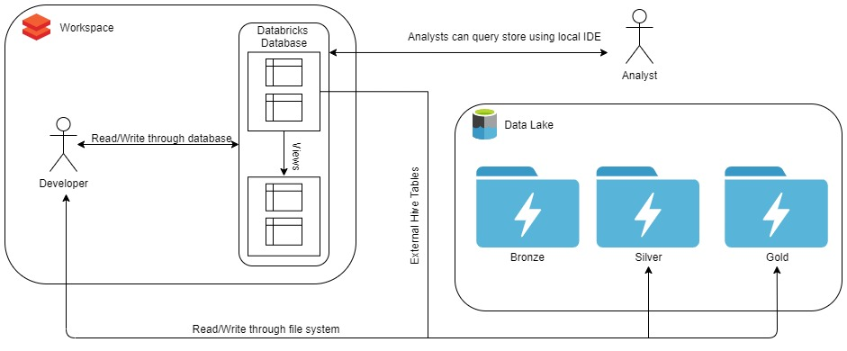

# Databricks Deployment 

In all of my Databricks and Data Lake projects there are common themes and functions that are consistent. In an effort to streamline my own projects and provide assistance to clients I am creating a repository of notebooks and scripts that can be used to configure, maintain, and leverage Azure Databricks at an enterprise level. 

The notebooks that are currently available are only the beginning and I will be adding more to them over time. 

The main feature at this time is the automated deployment and configuration of a Databricks workspace with ADLS Gen2. 

There are a number of key **assumptions** that I will make:
- A single [Azure Data Lake Store Gen2](https://docs.microsoft.com/en-us/azure/storage/blobs/data-lake-storage-introduction) account. 
    - This account will have three separate containers:
        - `bronze`: our raw data directory
        - `silver`: intermediate layer used to apply structure to our data. Note that there should be a minimum amount of transformations between bronze and silver, as our goal should be to tabularize and structure our data. We will assume this uses [Databricks Delta](https://databricks.com/blog/2017/10/25/databricks-delta-a-unified-management-system-for-real-time-big-data.html).
            - In some scenarios it could mean splitting the bronze datasets into multiple silver tables. 
        - `gold`: business data layer used to support solutions. Note, we leverage the silver layer as our source data to apply business logic and transformations to support specific business needs. We will assume this uses Databricks Delta.

- Each of the containers will be mounted to our Databricks workspace using the following format: 
    - `bronze` --- > `/mnt/datalake/<storage account name>/bronze`
    - `silver` --- > `/mnt/datalake/<storage account name>/silver`
    - `gold` --- > `/mnt/datalake/<storage account name>/gold`

- Under each of our mount points we will expect there to be three levels: **solution**, **project**, **table**. 
    - These levels allow for logical groupings of our data and allow the data lake to not only grow in depth but in width as more sources are added. 

Using the assumptions made here let's provide and example. Assume you are moving data from a Microsoft SQL Server to a data lake. The bronze layer may contain any file format json, parquet, csv etc. Since our source system is a relational database let's assume we are using parquet files that are being uploaded on a daily basis. Since we are only getting data on a daily basis we will land our data into folders organized by year and simply add a datetime to our file name. Our bronze layer would likely take the form: 

`/mnt/datalake/<storage account name>/bronze/<database name>/<schema name>/<table name>/2020/<table_name>_YYYYMMDDHHmmss.parquet`

Since our silver and gold layers are using Databricks Delta they will follow a similar format, excluding the year directory.

`/mnt/datalake/<storage account name>/silver/<database name>/<schema name>/<table name>`

Please note that all Delta tables will be created as external Hive tables in the following format: `<solution>__<project>_<gold or silver>.<table> `. This will allow users to easily access data via the Databricks Database and the file system.  This will allow users to easily access data via the Databricks Database and the file system. Please reference the following diagram for a high-level depiction of the solution.   
  

  

Notice that it is possible for users to query the hive store directly outside of the Databricks workspace. A few tools that I have used in the past are: 
- Power BI Desktop using the Spark connector  
- Visual Studio Code using [Databricks Connect](https://pypi.org/project/databricks-connect/)
    - Note users should be able to query the data lake directly as well.

## Notebooks Available

These notebooks aim to provide a jumpstart to configuring a Databricks workspace for ETL/ELT processing, and for continued management of a workspace. 

Notebooks are organized into different folders depending on their purpose in the solution. 
- [Admin:](Admin) a collection of notebooks purposed for managing and optimizing your Databricks and Delta Lake solution. This may include capturing data from the Databricks REST APIs or executing regular tasks to manage your solution. 
- [Setup:](Setup) a collection of notebooks and scripts purposed for automating the deployment and configuration of a Databricks workspace and Azure Data Lake Storage Gen2. 

### Admin Notebooks

The following notebooks can be *manually* imported into a workspace and executed. 
- [CreateSecret.py](Admin/CreateSecret.py): a notebook that will put a secret in a secret scope. 
- [CreateUtilityDatabase.py](Admin/CreateUtilityDatabase.py): a notebook that creates a utility_database in the hive metastore. This database will be used to capture various information about a Databricks workspace i.e. job run data. 

### Setup Notebooks

Please reference the [Setup README](Setup). 

