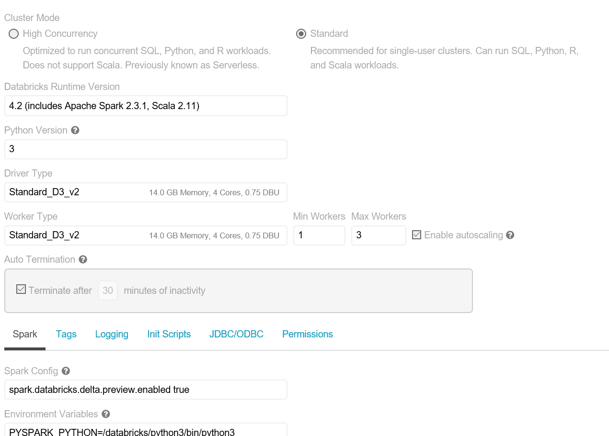
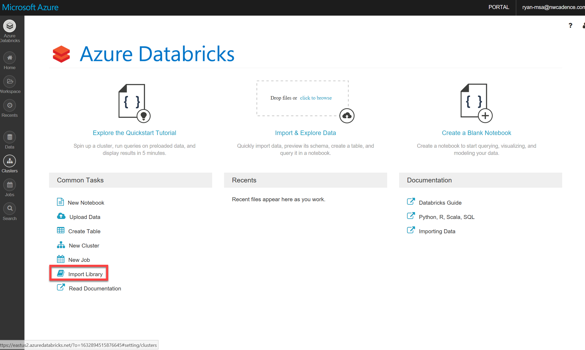
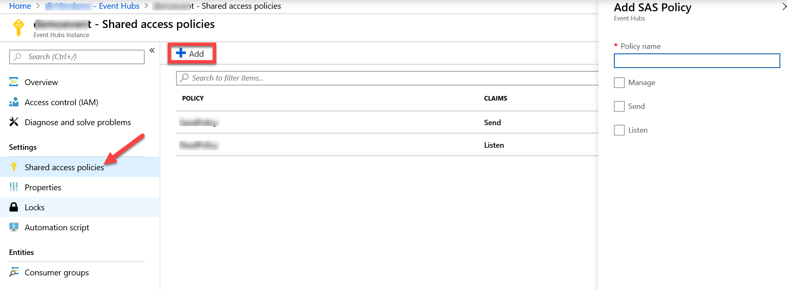

## Create the Required Azure Resources

1. Create an Azure Databricks Resource. Follow the instructions available [here](https://docs.microsoft.com/en-us/azure/azure-databricks/quickstart-create-databricks-workspace-portal).  
1. In the newly created Azure Databricks workspace. Create a databricks cluster. Please note an cluster with a max of 3 VMs using Standard_D3_v2 machines will suffice. Please note the example cluster below.   


1. Once your cluster is created you will need to import to libraries into your Azure Databricks workspace. On the Azure Databricks home page click "Import Library" (shown below).    


1. First select "Maven Coordinate" as your library source and import "azure-eventhubs-spark_2.11-2.3.6". Click "Create Library" and attach the library to your Databricks Cluster.  

1. Next select "Upload Python Egg or PyPI" and import the package "azure-eventhub" in the PyPi Name field. Click "Create Library" and attach the library to your Databricks Cluster.  

1. Create an Azure Event Hub by following these [instructions](https://docs.microsoft.com/en-us/azure/event-hubs/event-hubs-create).  
 
1. Create a Shared access policies for the event hub you just created. In the Azure portal navigate to your Event Hub.  


1. Then click on "Shared access policies" and add two. One policy with "Listen" permissions, and one policy with "Send" permissions.  


## Write Code to Send Data to Event Hub 

1. In Azure Databricks create a python notebook called "SendData". We will demonastrate a basic streaming solution before we develop a streaming machine learning solution on Databricks. We will use this notebook to send dummy data to our Event Hub so that we can then read it using another notebook. 

1. Import your required libraries by pasting the following code into your "SendData" notebook. Run the cell by attaching the notebook to your cluster and "CTRL+Enter". 
    ```python
    # import the required resources
    import sys
    import logging
    import datetime
    import time
    import os

    from azure.eventhub import EventHubClient, Sender, EventData
    ```

1. Set up your connection strings using the following code. Please provide the shared access policy with the "Send" credentials, and the event hub name space.       
    ```python
    logger = logging.getLogger("azure")

    # For example: "amqps://<mynamespace>.servicebus.windows.net/myeventhub"
    ADDRESS = ""

    # SAS policy and key are not required if they are encoded in the URL
    USER = ""
    KEY = ""
    ```

1. Now it is time to send data to your Event Hub! The following code sends integer values ranging between 0-19 to the event hub.  
    ```python 
    while(True):
        try:
            if not ADDRESS:
                raise ValueError("No EventHubs URL supplied.")

            # Create Event Hubs client
            client = EventHubClient(ADDRESS, debug=False, username=USER, password=KEY)
            sender = client.add_sender(partition="0")
            client.run()
            try:
                # send data
                start_time = time.time()
                for i in range(20):
                    print("Sending message: {}".format(i))
                    sender.send(EventData(str(i)))
            except:
                raise
            finally:
                end_time = time.time()
                client.stop()
                run_time = end_time - start_time
                logger.info("Runtime: {} seconds".format(run_time))

        except KeyboardInterrupt:
            pass

    ```

1. You have successfully written code that sends data to an Azure Event Hub! Pleae follow the "02_ReadStreamingData" to read data and visualize using Azure Databricks.  