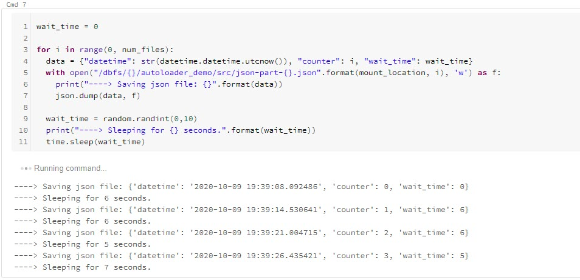
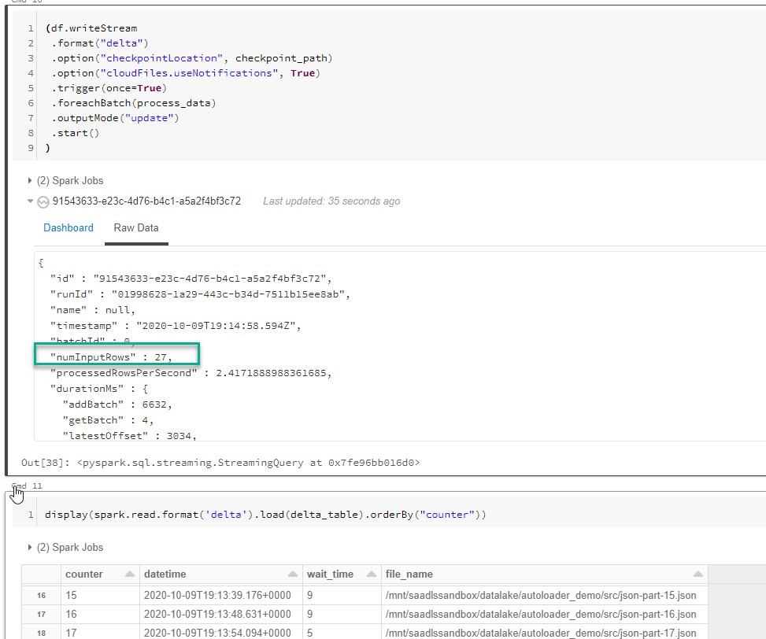
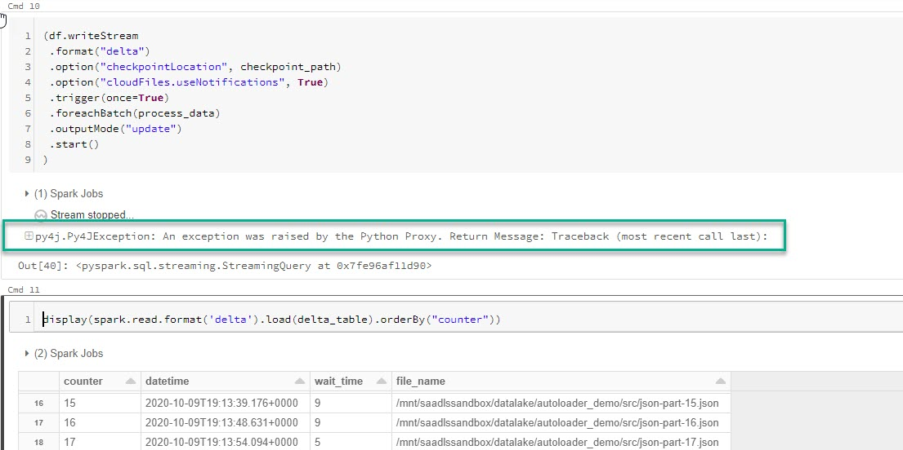
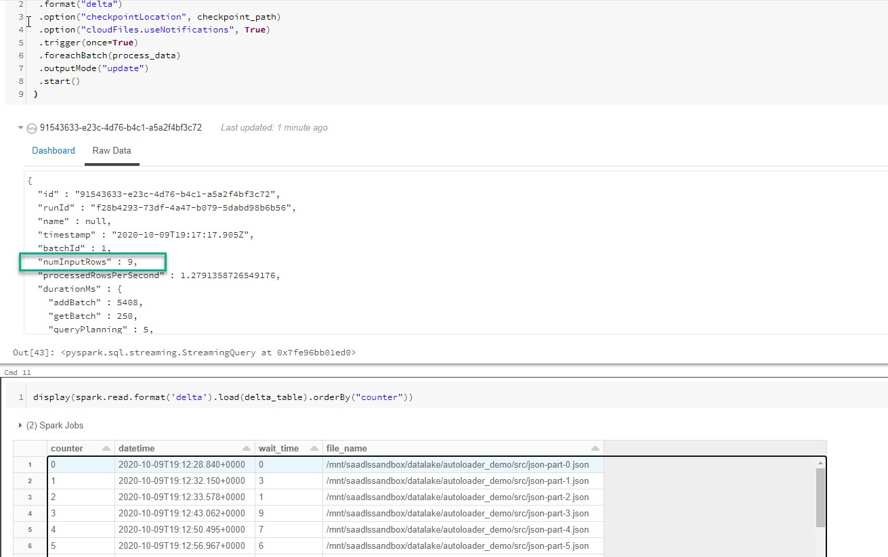

# Databricks Autoloader

Databricks autoloader is an efficient way to handle the processing of file-based streaming data. For example, it is very common for data to load into a bronze data directory (raw data) and process those files in batches or even streams. Often this requires keeping a manual log of which files have been processed and which files have not, which can grow cumbersome as the size and number of files grows. Databricks autoloader solves this problem. 

The autoloader has two settings:
- **Directory listing** which essentially determines which files need to be processed by listing the contents of a directory in parallel.  
- **File notification** involves a background service of Azure EventGrid and Queue Storage and maintains a subscription of which files need processing. The services are automatically provisioned and maintained, and this option is typically more scalable.  


For more information please refer to the following [documentation](https://docs.microsoft.com/en-us/azure/databricks/spark/latest/structured-streaming/auto-loader). It is specifically important to review the different [configuration options](https://docs.microsoft.com/en-us/azure/databricks/spark/latest/structured-streaming/auto-loader#configuration) available.  

## Example

General Steps:
1. Provide values and execute the [CreateData.py](src/CreateData.py) notebook.
1. Provide values and execute the [ProcessData.py](src/ProcessData.py) notebook. 

In this example we assume the following:  
- An ADLS Gen2 File System mounted by a service principal to the Databricks workspace
- A cluster with Databricks Runtime Version 7.2+

In order to simulate data landing into a data lake, we will use the [CreateData.py](src/CreateData.py) notebook. This notebook simply executes a loop saving json files to the storage location.  Using the `num_files` variable you can configure how many files will be saved to the location. Each file will contain a single row of data with three columns: `datetime` which is the current datetime, `counter` which is just an incremental column to provide data, and `wait_time` which is a randomized wait time between each file being created.  
```python
for i in range(0, num_files):
  data = {"datetime": str(datetime.datetime.utcnow()), "counter": i, "wait_time": wait_time}
  with open("/dbfs/{}/autoloader_demo/src/json-part-{}.json".format(mount_location, i), 'w') as f:
    print("----> Saving json file: {}".format(data))
    json.dump(data, f)
    
  wait_time = random.randint(0,10)
  print("----> Sleeping for {} seconds.".format(wait_time))
  time.sleep(wait_time)

```

1. In order to run this solution, ensure that you have mounted an ADLS Gen2 file system and provide the mount location: 
    ```python
    mount_location = "<path to adls file system>"
    ```

    You should see the files being created.  
    


1. Next we need to process the data using the [ProcessData.py](src/ProcessData.py) notebook. This notebook utilizes the `spark.streaming` APIs to process the data. We will simulate a batch failure to demonstrate the fault tolerance capabilities of the solution.  First you will need to set all your variables (both in scala and in python).  
    ```python 
    connection_string = "<ADLS Connection String>"
    rg_name = "<resource group name>"
    account_name = "<storage account name>"
    file_system = "<file system name>"
    client_id = "<service principal id>"
    client_secret = "<service principal secret>"
    tenant_id = "<directory id>"
    mount_location = "<mount location of adls file system>"
    subscription_id = "<subscription id>"
    delta_table = "{}/autoloader_demo/output/table".format(mount_location) 
    checkpoint_path = "{}/autoloader_demo/output/checkpoint".format(mount_location)

    %scala
    val connection_string = "<ADLS Connection String>"
    val rg_name = "<resource group name>"
    val account_name = "<storage account name>"
    val file_system = "<file system name>"
    val client_id = "<service principal id>"
    val client_secret = "<service principal secret>"
    val tenant_id = "<directory id>"
    val mount_location = "<mount location of adls file system>"
    val subscription_id = "<subscription id>" 


    ```

1. Then we can read in our data to a dataframe.  
    ```python
    df = (spark.readStream.format("cloudFiles")
    .option("cloudFiles.format", "json")
    .schema(sc)
    .load("{}/autoloader_demo/src/*.json".format(mount_location))
        )
    ```

1. Then using scala we will need to set the autoloader configuration.  
    ```scala
    %scala
    import com.databricks.sql.CloudFilesAzureResourceManager
    val manager = CloudFilesAzureResourceManager
    .newManager
    .option("cloudFiles.connectionString", connection_string)
    .option("cloudFiles.resourceGroup", rg_name)
    .option("cloudFiles.subscriptionId", subscription_id)
    .option("cloudFiles.tenantId", tenant_id)
    .option("cloudFiles.clientId", client_id)
    .option("cloudFiles.clientSecret", client_secret)
    .create()

    ```


1. In order to simulate a failure we are going to save a json file that we can use to force an error in a micro-batch. We will save a json file with a single value. 
    ```python
    data = {"fail": 0}
    with open("/dbfs/{}/autoloader_demo/output/failure.json".format(mount_location), 'w') as f:
        print("----> Saving json file: {}".format(data))
        json.dump(data, f)
    ```


1. Now we will write a Python function that gets executed with each micro-batch. Please notice that we read the `failure.json` file and if the value is 1 then we will purposely fail the process using a schema mismatch error.   
    ```python
    def process_data(microBatchDF, batchId):
    with open("/dbfs/{}/autoloader_demo/output/failure.json".format(mount_location), 'r') as f:
        cnt = json.load(f).get('fail')

    fail = True if cnt == 1 else False

    if fail and DeltaTable.isDeltaTable(spark, delta_table):
        microBatchDF = microBatchDF.withColumn("failCol", lit(1))
        microBatchDF = microBatchDF.withColumn("file_name", input_file_name())
        microBatchDF.write.format("delta").mode("append").save(delta_table)   
    else :
        microBatchDF = microBatchDF.withColumn("file_name", input_file_name())
        microBatchDF.write.format("delta").mode("append").option("mergeSchema", "true").save(delta_table)
    
    cnt+=1
    data = {"fail": cnt}
    with open("/dbfs/{}/autoloader_demo/output/failure.json".format(mount_location), 'w') as f:
        print("----> Saving json file: {}".format(data))
        json.dump(data, f)
    ```


1. Then we will trigger the `writeStream` to create a delta table. Notice that we trigger this stream only once, and for each batch of data we execute our `process_data` function.  
    ```python
    (df.writeStream
    .format("delta")
    .option("checkpointLocation", checkpoint_path)
    .option("cloudFiles.useNotifications", True) # if set to False then it will use directory listing
    .trigger(once=True)
    .foreachBatch(process_data)
    .outputMode("update")
    .start()
    )
    ```
    After executing the command above we will create a delta table and update our `failure.json` file so that the value is `1`. You can see in the screenshot below that I processed 27 files (one row per file). If you were to display the delta table you will see the counter values 0-26.    
    


1. If we re-execute the command above we will introduce a schema mismatch failure which is caused by adding a row in the source dataframe that is not present in our target table. This is important because between the two executions data has been added to the source directory. This is to show that if a process fails that the autoloader will still load all required data the next time around i.e. it will load all data exactly once.      



1. Executing one last `writeStream` you will see that we processed 9 rows, and if we display the output table we can clearly see that the counter values are 0-35 showing that we did not miss any files that needed to be processed even though there was a failure.   
