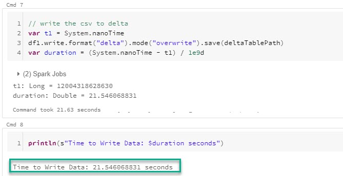
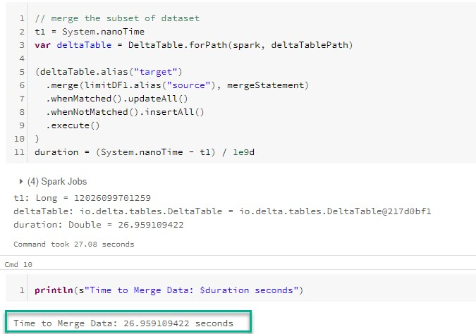
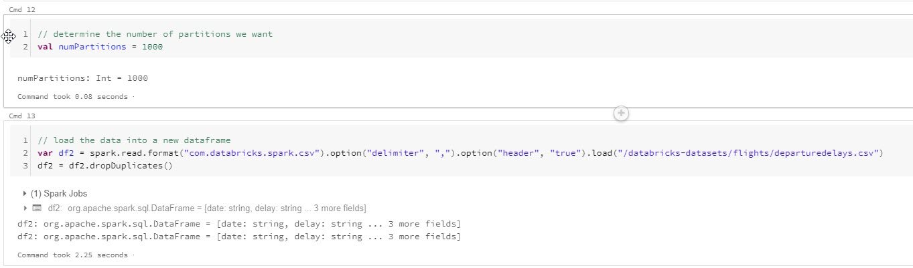
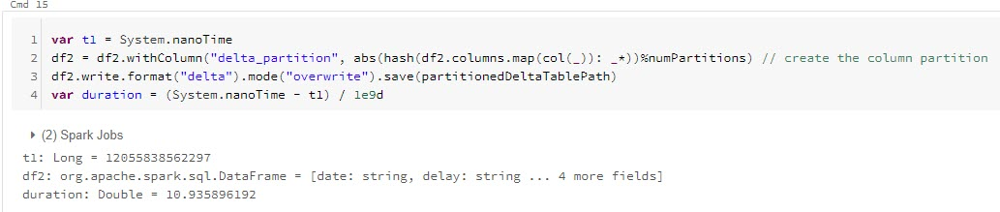
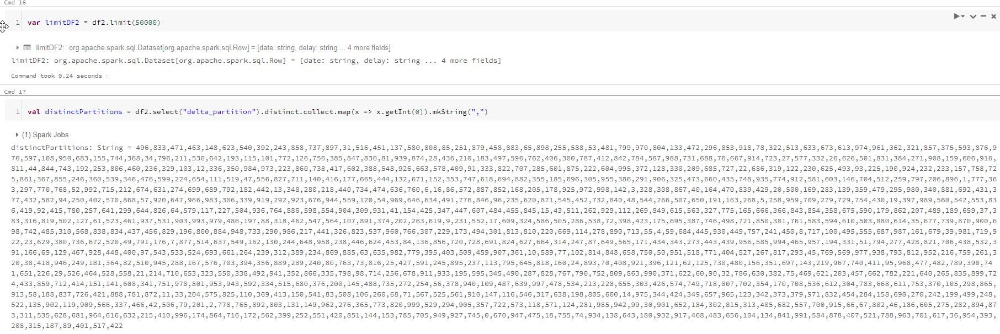
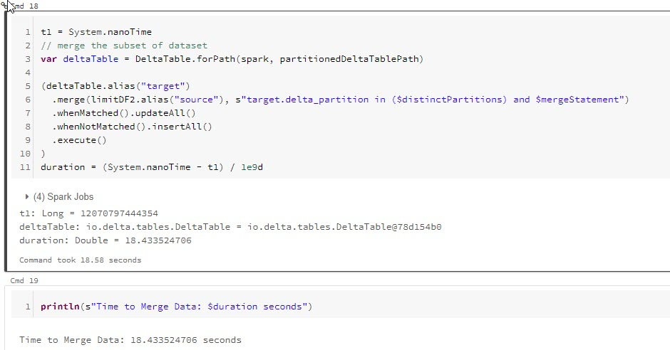

# Getting Data Changes in Delta Lake

Azure Databricks is an excellent tool to handle data operations in the cloud as streams and as batches. In this example I would like to focus on batch processing within a Delta Lake using Azure Databricks. Please note that some of these operations can be applied to stream processing as well.  

In big data scenarios it is common to only process the changes since the last processing took place, allowing us to reduce the overall size of the data we need to transform. This is opposed to loading the entire dataset each time, applying transformations, and overwriting the target dataset. 

There are a number of operations you should be familiar with in order to get changes within a Delta Lake. I will provide short code snippets showing how to do the following:
1. Get the inserted and updated rows 
    1. [DataFrame Comparison](DataFrameComparison.md)
    1. [Streaming API](StreamingAPI.md)
1. [Get the deleted and updated rows](DataFrameComparison.md)
1. [Get only the deleted rows](DataFrameComparison.md)
1. Partitioning Data for Merges - See Below


## Partitioning Data for Merges

While working through these CDC changes it became apparent that the merge operation can be inefficient on larger datasets if it is not partitioned correctly. In the solution I was working on I needed to have a dynamic partition strategy that allowed me to update rows not only on multiple primary keys but on the specific partition that row was stored in.

In my [`cdc_merge_examples.scala`](cdc_merge_examples.scala) notebook, we use a built in databricks dataset to perform merge operations on a delta table with specified partitions and a delta table with the default partitions. 

First we will need to import the required libraries and we will set the file paths to our delta tables.  


Next we will read our dataset into a dataframe. In our scenario we are using the flights dataset that is available in all Databricks workspaces. Please notice we will be using `df1` to initialize our delta table, and we will be using `limitDF1` as the datafrom we are going to upsert. Additionally, we will use all of our columns in our dataframe as keys to upsert the data into the delta table, therefore, we will iterate the columns and format a string for our merge command.   


We will write our dataframe to the delta table with the default number of partitions.   




After we create our delta table we will upsert 50,000 records into the delta table.  




Next we will define the number of partitions we want our delta table to have, and load our dataset into another dataframe. NOTICE -   



Quickly, we write our data to a delta table. Please make note of the following code: 
```scala
df2 = df2.withColumn("delta_partition", abs(hash(df2.columns.map(col(_)): _*))%numPartitions) // create the column partition
```

This peice of code will hash the primary keys and using a modulo operator. This assigns each one into a specific partition allowing us to always insert, update, or delete a row based off the keys and limiting which partitions are needed to scan. By limiting the partitions we are able to make operations run faster by skipping datasets. 



We will write our dataset to our delta table, then in order to know which partitions we are operating on we must select the distinct partitions from our source dataframe of 50,000 rows.  




Then finally we are able to perform our upsert operation which you will notice is an improvement in speed over the previous merge command.   



You will notice in the code above the following line. In this example, our `in` criteria allows us to limit the partitions, and the `mergeStatement` allows us to match rows in the partition.  
```scala
.merge(limitDF2.alias("source"), s"target.delta_partition in ($distinctPartitions) and $mergeStatement")
```