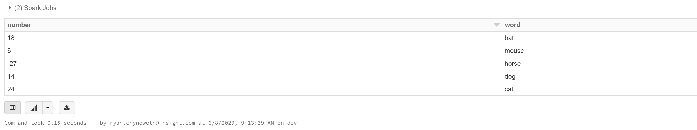
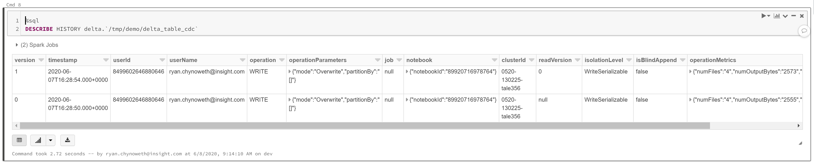
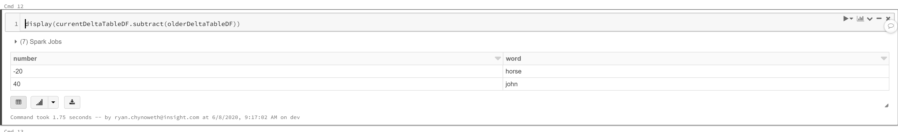
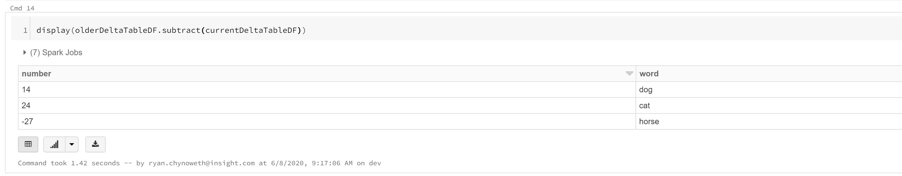
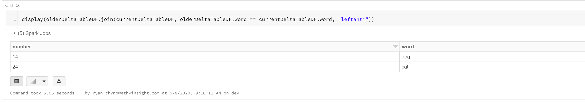

# CDC Operations within a Delta Lake


Azure Databricks is an excellent tool to handle data operations in the cloud as streams and as batches. In this example I would like to focus on batch processing within a Delta Lake using Azure Databricks. 

In big data scenarios it is common to only process the changes since the last processing took place, allowing us to reduce the overall size of the data we need to transform. This is opposed to loading the entire dataset each time, applying transformations, and overwriting the target dataset. 

There are a number of operations you should be familiar with in order to get changes within a Delta Lake. I will provide short code snippets showing how to do the following:
1. Get the inserted and updated rows 
1. Get the deleted and updated rows
1. Get only the deleted rows


### Create and update a dataset

Within a Databricks environment, create a Python Notebook. 

First we need to generate a Spark Dataframe, we will use Pandas to source our data then convert the dataframe to a Spark Dataframe. 
```python
import pandas as pd

initDF = pd.DataFrame([[18, "bat"],
  [6, "mouse"],
  [-27, "horse"],
  [14, "dog"],
  [24, "cat"]], columns=["number", "word"])

display(initDF)
```

Our inital dataset will look like the following:  


Now we need to save our dataframe as a Delta table. 
```python
initDF = spark.createDataFrame(initDF)

initDF.write.format("delta").mode("overwrite").option("schemaOverwrite", "true").save("/tmp/cdc_demo/delta_table_cdc")
```

In this example we will delete two rows, insert one row, and update one row. To make things simple, we will create another dataframe and simply overwrite our delta table.  
```python
updateDF = pd.DataFrame([[18, "bat"],
  [6, "mouse"],
  [-20, "horse"],
  [40, "john"]], columns=["number", "word"])

updateDF = spark.createDataFrame(updateDF)

updateDF.write.format("delta").mode("overwrite").option("schemaOverwrite", "true").save("/tmp/cdc_demo/delta_table_cdc")
```


### Getting Delta Table Changes

Databricks Delta maintains a history of tables. For more information on its capabilities please reference the Databricks Documentation. For now, let's take a look at the history of our delta table. Note, use the magic command to make the cell a sql cell. 
```python
%sql
DESCRIBE HISTORY delta.`/tmp/demo/delta_table_cdc`
```

You will see the following table. 
 

To access older versions of a delta table we can use the `versionAsOf` or `timestampAsOf` options when reading the data. Those arguments correspond to the columns within the history table displayed above. I prefer to use the version number, as it is easier to manage an integer as a watermark than a date, but they both work great. 

```python
currentDeltaTableDF = spark.read.format("delta").load("/tmp/demo/delta_table_cdc")

olderDeltaTableDF = spark.read.format("delta").option("versionAsOf", 0).load("/tmp/demo/delta_table_cdc") 
```

To get the **inserts and updates** run the following command:
```python
display(currentDeltaTableDF.subtract(olderDeltaTableDF))
```
 


To get the **deletes and updates** run the following command:
```python
display(olderDeltaTableDF.subtract(currentDeltaTableDF))
```
 


To get only the **deletes** run the following command:
```python
display(olderDeltaTableDF.join(currentDeltaTableDF, olderDeltaTableDF.word == currentDeltaTableDF.word, "leftanti"))
```
 
