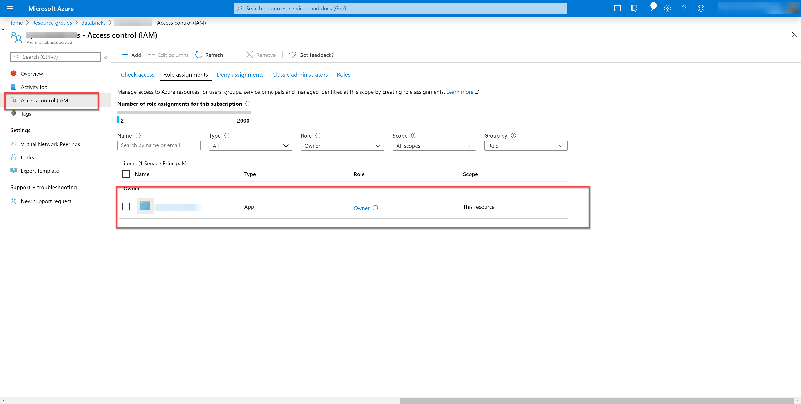

# Generate Databricks Access Token

One obstacle that a lot of clients have with Databricks, is the management and use of Azure Databricks Access Tokens. Databricks tokens are an easy and secure way to connect and authenticate with the [Azure Databricks REST APIs](https://docs.databricks.com/dev-tools/api/latest/index.html). Traditionally, users were required to create a token using the portal, however, then the Token API allowed users to programmatically manage their Databricks token. But, users were still required to manually create an initial Databricks token to authenticate against the REST APIs and those tokens were still tied to user accounts. Meaning, if users leave an organization their Tokens will expire as well. 

- [Traditional Access Token Creation](https://docs.databricks.com/dev-tools/api/latest/authentication.html#generate-a-token)
- [Tokens API](https://docs.databricks.com/dev-tools/api/latest/tokens.html)

Then I read this [blog](https://cloudarchitected.com/2020/01/using-azure-ad-with-the-azure-databricks-api/), that outlines Using Azure AD With The Azure Databricks API. This means that the new best practice to generating and managing Azure Databricks tokens is to use a service principal!


All you will need to do is to provide the service principal access to the Databricks workspace.  



## Generating the Token

1. Using a Python 3.6+ environment, pip install the following packages:
    ```
    requests==2.22.0
    adal==1.2.2
    ```

1. Provide the following values:
    ```python
    import requests
    import adal
    import json

    # set variables 
    clientId = "<Service Principal Id>"
    tenantId = "<Tenant Id>"
    clientSecret = "<Service Principal Secret>"
    subscription_id = "<Subscription Id>"
    resource_group = "<Resource Group Name>"
    databricks_workspace = "<Databricks Workspace Name>"
    dbricks_location = "<Databricks Azure Region i.e. westus>"
    ```

1. Generate the following tokens against the Azure Management API and the Global Databricks resource.  
    ```python

    # Acquire a token to authenticate against Azure management API
    authority_url = 'https://login.microsoftonline.com/'+tenantId
    context = adal.AuthenticationContext(authority_url)
    token = context.acquire_token_with_client_credentials(
        resource='https://management.core.windows.net/',
        client_id=clientId,
        client_secret=clientSecret
    )
    azToken = token.get('accessToken')


    # Acquire a token to authenticate against the Azure Databricks Resource
    token = context.acquire_token_with_client_credentials(
        resource="2ff814a6-3304-4ab8-85cb-cd0e6f879c1d",
        client_id=clientId,
        client_secret=clientSecret
    )
    adbToken = token.get('accessToken')
    ```

1. Finally, format the request and post it against the token api.  
    ```python
    # Format Request API Url
    dbricks_api = "https://{}.azuredatabricks.net/api/2.0".format(dbricks_location)


    # Request Authentication
    dbricks_auth = {
        "Authorization": "Bearer {}".format(adbToken),
        "X-Databricks-Azure-SP-Management-Token": azToken,
        "X-Databricks-Azure-Workspace-Resource-Id": ("/subscriptions/{}/resourceGroups/{}/providers/Microsoft.Databricks/workspaces/{}".format(subscription_id, resource_group, databricks_workspace) )
        }


    # Optional Paramters 
    payload = {
        "comment": "This token is generated through AAD and Databricks APIs", # optional parameter
        # "lifetime_seconds": 3600 # optional parameter. If not passed then it is indefinte
    }


    # Request and Send Data to Create a Databricks Token
    data = requests.post("{}/token/create".format(dbricks_api), headers= dbricks_auth, json=payload)
    ```

1. Then get the token from the response. 
    ```python
    # Decode response, get token, and print token
    dict_content = json.loads(data.content.decode('utf-8'))
    token = dict_content.get('token_value')
    print("This is the databricks token: {}".format(token))
    ```


You can now fully automate the creation and management of Databricks tokens!